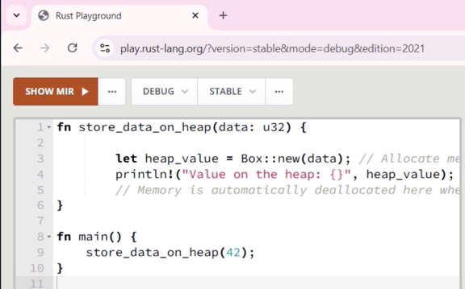

# Rust가 메모리 안전(memory safe)하다고 말하는 것은 무엇을 의미하는가

**메모리 관련 오류를 유발하는 방식으로 코드를 작성할 수 없음**

* ❌ 널 포인터 역참조 (Null pointer dereference)
* ❌ 해제 후 사용 (Use after free)
* ❌ 댕글링 포인터 (Dangling pointers)
* ❌ 이중 해제 (Double free)
* ❌ 버퍼 오버플로우 (Buffer overflows)
* ❌ 메모리 누수 (Memory Leaks) (대부분 방지됨; 어떤 언어도 모든 시나리오에서 메모리 누수를 완벽하게 막을 수는 없음)
* ❌ 데이터 경쟁 (Data races)
* ❌ 초기화되지 않은 메모리 접근 (Uninitialized memory access)
* ❌ 타입 혼동 (Type confusion)

> 언어의 핵심 원칙 덕분에 안전한 Rust(safe Rust)에서는 메모리 불안전 코드를 작성하는 것이 불가능함


## 널 포인터 버그와 작별하세요 👋

* Rust에는 널 포인터라는 개념이 없음
* Rust는 값의 존재 또는 부재를 나타내기 위해 `Option<T>` 타입을 사용함
* 어떤 포인터든 암시적으로 NULL이 될 수 있는 C나 C++와 달리, Rust의 참조(`&T` 또는 `&mut T`)는 항상 유효하고 null이 아닌 메모리를 가리키도록 보장됨 컴파일러는 컴파일 시점에 이를 강제하여 널 참조를 불가능하게 만듦

> 코드가 성공적으로 컴파일된다면, 모든 참조 접근이 유효하다는 것이 100% 보장됨

## Rust가 널 포인터를 제거하는 방법

1. 모든 변수는 사용 전에 반드시 초기화되어야 함
2. Rust 참조는 항상 유효하며 null이 될 수 없음 이것은 의도된 설계임
3. `Option<T>`를 사용하면 값이 없을 수 있는 경우를 명시적으로 처리해야 함 컴파일러는 정확성을 보장하며 이를 강제함
4. 원시 포인터(Raw pointers)는 `unsafe` 블록 내에서만 허용됨

```rust
fn main() {
    let x: Option<&i32> = None;
    println!("{:?}", x);

    match x {
        
    }
}
```


```c
void cleanup(char** buffer) {
    if (*buffer != NULL) {
        printf("Freeing memory...\n");
        free(*buffer);
        // Nullify the pointer to indicate it's been freed
        *buffer = NULL;
    }
}

// process the file content
void process_file(const char* buffer) {
    if (buffer == NULL) {
        printf("Error: Cannot process file, memory has been freed.\n");
        return;
    }
    // Access the data
    printf("Processing file content: %s\n", buffer);
}

int main() {
    // Load file content
    char* file_content = read_file("test.txt");

    // Simulate a cleanup step
    cleanup(&file_content);

    // Attempt to process the file after it has been freed
    process_file(file_content);

    return 0;
}
```

```c
int main() {
    int* original_ptr = (int*)malloc(sizeof(int));
    *original_ptr = 42;

    // Copy of the pointer
    int* copied_ptr = original_ptr;

    // Frees memory, but doesn't affect `copied_ptr`
    free_memory(original_ptr); // Assuming free_memory handles NULL check and frees

    // `original_ptr` might be NULL (if free_memory sets it), but `copied_ptr` is still dangling
    use_pointer(copied_ptr); // Undefined behavior

    return 0;
}
```

```rust
fn main() {
    // allocates heap memory to store integer 42
    let original_ptr = Box::new(42);

    // Borrow smart pointer
    let copied_ptr = &original_ptr;

    // Attempting to drop original_ptr while copied_ptr still borrows it
    drop(original_ptr);

    // borrowed smart pointer later used here
    println!("Value: {}", copied_ptr);
}
```

## Rust는 원시 포인터(Raw pointers)와 스마트 포인터(Smart pointers)를 모두 지원함

* ✅ 원시 포인터는 **안전한 Rust(`safe Rust`)**에 노출되지 않으며 **`unsafe`** 코드에서만 사용 가능함
* ✅ 스마트 포인터는 메모리를 자동으로 관리하고, 런타임 가비지 컬렉션에 의존하지 않으면서 범위(scope)를 벗어날 때 정리를 보장함

```rust
fn store_data_on_heap(data: u32) {
    let heap_value = Box::new(data); // Allocate memory on the heap
    println!("Value on the heap: {}", heap_value);
    // Memory is automatically deallocated here when `heap_value` goes out of scope
}

fn main() {
    store_data_on_heap(42);
}
```

