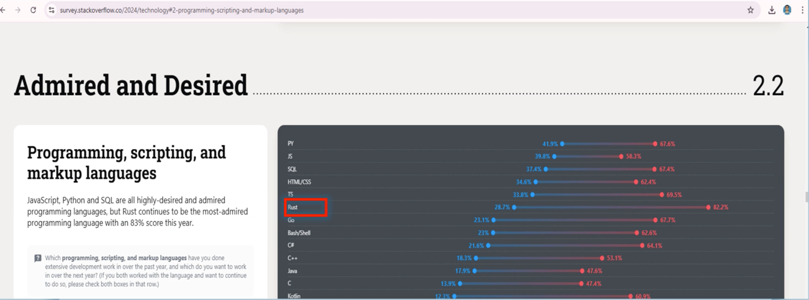
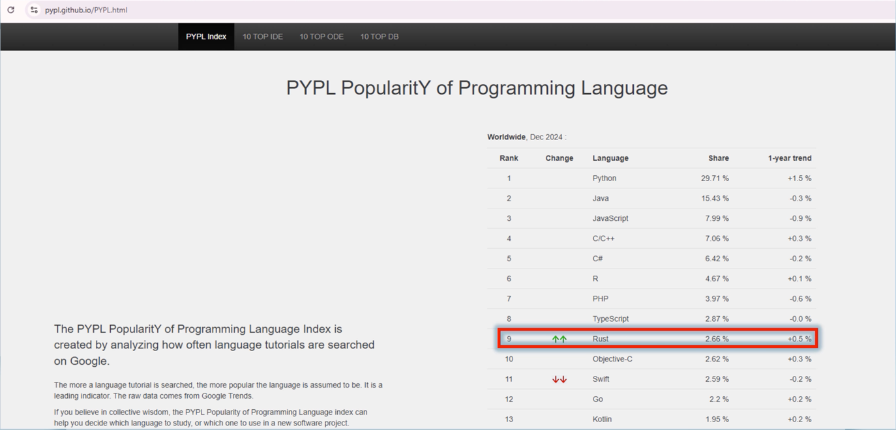

# Rust Programming Language

1. Rust는 시스템 소프트웨어 작성을 위해 설계된 시스템 프로그래밍 언어입니다. 빠르고 효율적이며 신뢰할 수 있도록 개발되었습니다
2. Rust는 정적으로 유형이 지정됩니다. 이는 변수 유형이 런타임이 아닌 컴파일 타임에 알려짐을 의미합니다. 이를 통해 보다 효율적이고 예측 가능한 성능을 얻을 수 있습니다
3. Rust는 컴파일된 언어입니다. 즉, 소스 코드를 실행하려면 먼저 기계어 코드로 번역해야 합니다
4. Rust는 안전성, 동시성, 메모리 관리를 강조합니다. 소유권 및 차용 시스템을 통해 메모리 안전을 제공하므로 널 포인터 역참조 및 버퍼 오버플로와 같은 일반적인 프로그래밍 오류를 방지하는 데 도움이 됩니다

## Support for OOP

Rust는 구조(구조체)와 특성을 사용하여 객체 지향 프로그래밍(OOP)을 지원합니다    
OOP에 대한 Rust의 접근 방식은 Java나 C++와 같은 기존 OOP 언어만큼 완전히 개발되지는 않았지만 일반적인 OOP 디자인 패턴을 구현하는 데 충분한 기능을 제공합니다    
Rust의 소유권 및 차용 모델은 안전하고 예측 가능한 객체 수명을 보장하는 데 도움이 되므로 OOP 프로그래밍에 적합한 선택입니다

## C와 C++이 이미 있는데 왜 Rust를 배워야 할까요?

- ✅ 메모리 안전성: 메모리 관련 불안전한 작업으로 인한 버그를 제거합니다
- ✅ 타입 안전성: 타입 오류를 방지하고 예측 가능한 코드 동작을 보장합니다
- ✅ 최신 도구: 의존성 및 빌드 관리를 위한 공식 도구 cargo가 있습니다
- ✅ 빠른 성능: 제로 코스트 추상화(zero-cost abstractions)를 통해 C/C++ 속도에 필적합니다
- ✅ 두려움 없는 동시성: 정의되지 않은 동작(undefined behavior)에 대한 걱정 없이 동시성 코드를 더 쉽게 작성할 수 있습니다

## Rust가 빛을 발하는 분야

- ✅ 시스템 프로그래밍 (운영체제, 장치 드라이버)
- ✅ 임베디드 시스템 (마이크로컨트롤러, IoT 기기)
- ✅ 웹 개발 (백엔드 서버, API, 프레임워크)
- ✅ 게임 개발 (실시간 렌더링, 물리 엔진)
- ✅ 블록체인 및 암호화 (스마트 계약, 보안 애플리케이션)
- ✅ 고성능 컴퓨팅 (시뮬레이션, 데이터 처리)
- ✅ 금융 및 트레이딩 시스템 (저지연 트레이딩 플랫폼)
- ✅ 사이버 보안 (보안 애플리케이션)
- ✅ 그 외 다수—Rust는 계속해서 여러 산업 분야에서 채택이 증가하고 있습니다

### 첫 번째 기사

구글의 Rust 프로그래밍 전환으로 안드로이드 메모리 취약점 68% 감소

2024년 9월 25일 & Ravie Lakshmanan

### 두 번째 기사

데브옵스(DEVOPS)

구글의 Rust 개발자, C++ 팀보다 생산성 2배 높아

초콜릿 팩토리의 Bergstrom "코드가 프로덕션 환경에서 훌륭하게 빛을 발한다"고 말함

Thomas Claburn
2024년 3월 31일 일요일 16:33 UTC

### 세 번째 기사

최고 보안 책임자(CSO)

이 기사는 1년 이상 되었음

마이크로소프트, 핵심 윈도우 코드를 메모리 안전한 Rust로 재작성 중

우리가 지지할 수 있는 C(언어)의 변화

Thomas Claburn
2023년 4월 27일 목요일 20:45 UTC

### 존경받고 선호되는 (언어들) ...

프로그래밍, 스크립팅, 마크업 언어

자바스크립트, 파이썬, SQL은 모두 매우 선호되고 존경받는 프로그래밍 언어들이지만, Rust는 올해 83%의 점수로 계속해서 가장 존경받는 프로그래밍 언어가 되었음

지난 1년간 어떤 프로그래밍, 스크립팅, 마크업 언어로 광범위한 개발 작업을 수행했으며, 내년에는 어떤 언어로 작업하고 싶으신가요 
(만약 해당 언어로 작업했고 계속 작업하기를 원한다면, 해당 행의 두 상자를 모두 선택해 주세요)

### PYPL 프로그래밍 언어 인기

PYPL 프로그래밍 언어 인기 지수(PYPL PopularitY of Programming Language Index)는 구글에서 언어 튜토리얼이 얼마나 자주 검색되는지를 분석하여 생성됨

언어 튜토리얼이 더 많이 검색될수록 해당 언어는 더 인기 있는 것으로 간주됨 이것은 선행 지표이며, 원시 데이터는 구글 트렌드에서 가져옴

만약 당신이 집단 지성을 믿는다면, PYPL 프로그래밍 언어 인기 지수는 어떤 언어를 공부할지 또는 새로운 소프트웨어 프로젝트에 어떤 언어를 사용할지 결정하는 데 도움을 줄 수 있음