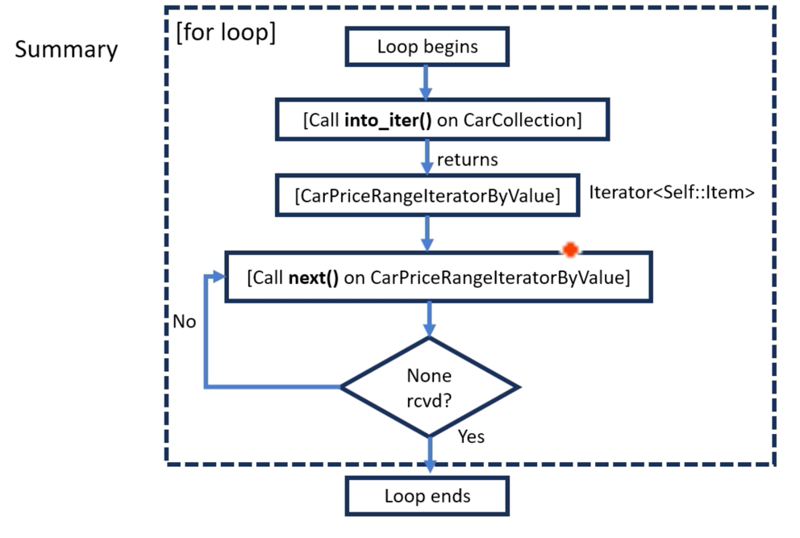

# Implementing Trait `IntoIterator` for a custom type (Part 4) Solution

```rust
// Custom iterator for iteration by-value
struct CarPriceRangeIteratorByValue {
    remaining_cars: std::vec::IntoIter<Car>,
    price_range: (u32, u32),
}


// Custom iterator for iteration by-immutable-reference
struct CarPriceRangeIteratorByRef<'a> {
    remaining_cars: std::slice::Iter<'a, Car>,
    price_range: (u32, u32),
}


// Custom iterator for iteration by-mutable-reference
struct CarPriceRangeIteratorByMutRef<'a> {
    remaining_cars: std::slice::IterMut<'a, Car>,
    price_range: (u32, u32),
}
```

```rust
// Custom iterator for iteration by-immutable-reference
// 불변 참조를 통한 반복을 위한 사용자 정의 이터레이터
struct CarPriceRangeIteratorByRef<'a> {
    remaining_cars: std::slice::Iter<'a, Car>, // 1, 2, 3 설명에 해당
    price_range: (u32, u32),
}
```

1.  **``Iter``** 는 슬라이스(slice)를 반복하기 위한 이터레이터 타입임 (``Car`` 객체의 슬라이스를 반복함)
2.  **``'a``** 는 라이프타임 파라미터임 이터레이터가 생성할 슬라이스 내 참조들의 라이프타임을 나타냄 본질적으로, 이터레이터가 사용 중인 동안 이터레이터가 가리키는 데이터가 파괴되지 않도록 보장하는 방법임
3.  **``Car``** 는 이터레이터가 참조를 생성할 타입임 따라서 ``Iter<'a, Car>`` 는 ``&'a Car`` 타입 (라이프타임 ``'a`` 를 가진 ``Car`` 객체에 대한 참조)의 아이템을 생성함



``IntoIterator`` 구현은 ``CarCollection`` 이 반복되는 방식에 유연성을 제공하여, 컨텍스트의 필요에 따라 다른 반복 전략을 가능하게 함 (예: 컬렉션 소모, 수정 없이 읽기, 또는 요소 수정)