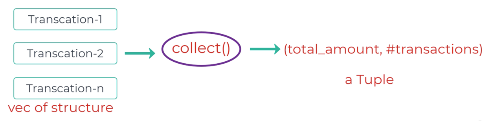

# Rust 이터레이터를 사용한 사용자 정의 컬렉션

금융 거래(transaction)를 처리하고 요약하는 프로그램을 만드시오 먼저, 거래 금액과 설명을 위한 필드를 가진 `Transaction` 구조체를 정의하시오 목표는 거래 데이터를 요약을 나타내는 튜플로 집계하는 것임 이를 위해, 튜플, 특히 (`f64`, `usize`) 타입에 대해 `FromIterator` 트레잇을 구현하시오 여기서 첫 번째 요소는 모든 거래의 총 금액이고 두 번째는 거래 횟수임 `main` 함수에서는 `Transaction` 인스턴스의 벡터(`vector`)를 생성하고 `collect()` 메소드를 사용하여 이 벡터를 요약 튜플로 변환하시오



```rust
/*
Create a program that processes and summarizes financial transactions.
First, define a Transaction struct with fields for the transaction amount
and a description. The goal is to aggregate the transaction data into a
tuple representing the summary. For this , Implement the FromIterator
trait for a tuple, specifically (f64, usize), where the first element
is the total amount of all transactions and the second is the count
of transactions. In the main function, create a vector of Transaction
instances and use the collect() method to convert this vector into
summary tuple
*/

#[derive(Debug)]
struct Point { // Note: The struct name is Point in the image, not Transaction
    x: i32,
    y: i32,
}

fn main() {
    let data = [(1, 2), (3, 4), (5, 6)];

    let points: Vec<Point> = data.into_iter() // Note: data.into_iter() iterates over copies for arrays of Copy types
        .map(|(x, y)| Point{x, y})
        .collect();

    println!("{:?}", points);
}
```

```bash
[Point {x: 1, y: 2}, Point {x: 3, y: 4}, Point {x: 5, y: 6}]
```

```rust
#[derive(Debug)]
struct Transaction {
    amount: f64,
    description: String,
}

fn main() {
    let transactions = vec![
        Transaction {
            amount: 100.0,
            description: "Groceries".to_string(),
        },
        Transaction {
            amount: 40.0,
            description: "Gas".to_string(),
        },
        Transaction {
            amount: 60.0,
            description: "Internet Bill".to_string(),
        },
    ];

    // FromIterator 구현이 필요함 (코드에는 생략됨)
    let summary: (f64, usize) = transactions.into_iter().collect();

    println!("{:?}", summary);
}
```

```bash
 Exited with status 101

Standard Error

Compiling playground v0.0.1 (/playground)
error[E0277]: a value of type `(f64, usize)` cannot be built from an iterator over elements of type `Transaction`
  --> src/main.rs:37:58
   |
37 |     let summary: (f64, usize) = transactions.into_iter().collect();
   |                                                          ^^^^^^^ value of type `(f64, usize)` cannot be built from `std::iter::Iterator<Item=Transaction>`
   |
   = help: the trait `FromIterator<Transaction>` is not implemented for `(f64, usize)`
   = help: the trait `FromIterator<()>` is implemented for `()` // Example implementation, not directly relevant
note: the method call chain might not have had the expected associated types
  --> src/main.rs:37:46
   |
22 |     let transactions = vec![
   |                        -----
...
25 |             description: "Groceries".to_string(),
   |             -----------------------------------
...
34 |         },
35 |     ];
   |     - this expression has type `Vec<Transaction>`
   ...
37 |     let summary: (f64, usize) = transactions.into_iter().collect();
   |                                              ^^^^^^^^^^
```
