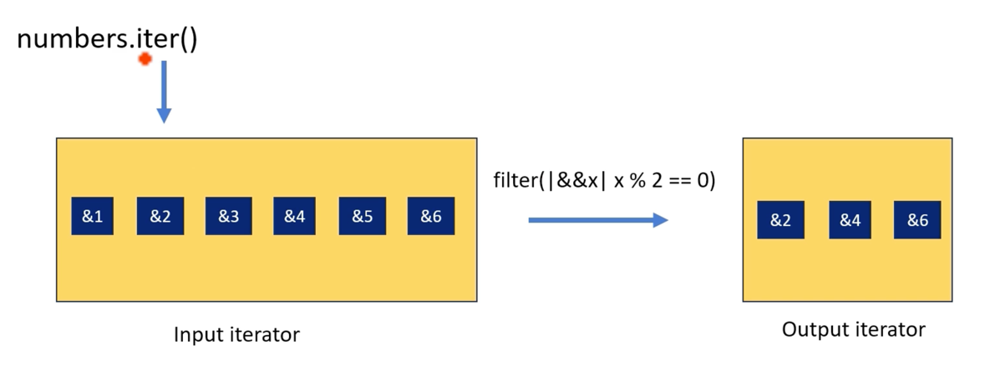
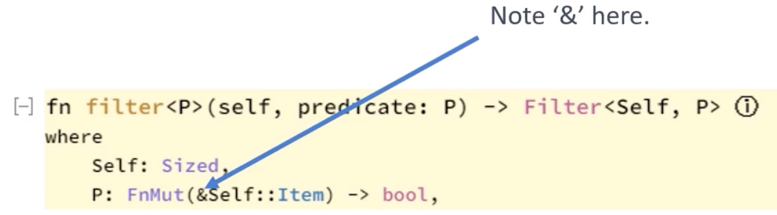

# `filter()`

```rust
fn filter<P>(self, predicate: P) -> Filter<Self, P>
where
    Self: Sized,
    P: FnMut(&Self::Item) -> bool,
```

element를 생성해야 할지 결정하기 위해 closure를 사용하는 iterator를 생성함

`filter()` adaptor는 closure를 인자로 받음 이 closure는 iterator의 각 element에 대해 `true` 또는 `false` 를 반환해야 함 closure가 `true` 를 반환하면 해당 element는 새 iterator에 포함되고, `false` 이면 제외됨



* `Filter()`, `map` 처럼, 지연(lazy) 평가됨 이는 `filter` 에 제공된 `closure` 가 `iterator` 의 모든 `element` 에 즉시 적용되지 않음을 의미함 대신, `iterator` 가 진행됨에 따라 (일반적으로 루프 또는 `collect` 와 같은 다른 소비 `method` 가 호출될 때) `element` 가 하나씩 처리됨
* 부수 효과(side effects)를 일으키는 데 사용되지 않음
* `filter` `method` 는 `iterator` 의 각 `element` 에 대한 참조(reference)를 받는 `closure` 를 인자로 받음
* `filter` 는 `element` 를 변환하는 것이 아니라 선택하기 위한 것임



> `filter()` 는 `element` 를 수정하거나 소비하지 않지만, `map()` 은 `iterator` `type` 에 따라 `element` 를 소비하거나 수정할 수 있음

`filter()` `method` 를 사용할 때, `closure` 를 호출하면서 `iterator` 의 각 `element` 에 대한 참조(reference)를 제공함

1.  참조(References)를 생성하는 Iterators (`iter()`):
    1.  `element` 에 대한 참조(`&T`, 예: T `type` 벡터)를 생성하는 `iter()` 로 시작하면, `filter()` `closure` 는 이 참조들에 대한 참조를 받게 되어 결과적으로 `&&T` 를 얻게 됨
2.  소유된 값(Owned Values)을 생성하는 Iterators (`into_iter()`):
    1.  소유된 값 (T, 예: T `type` 벡터)을 생성하는 `into_iter()` 로 시작하면, `filter()` `closure` 는 이 소유된 값들에 대한 참조를 받게 되어 결과적으로 `&T` 를 얻게 됨

```rust
#[derive(Debug)]
struct Point {
    x: i32,
    y: i32,
}

// Run | Debug
fn main() {
    let numbers: Vec<Point> = vec![Point {x: 4, y: 6}, Point {x: 7, y: 10}];

    let less_than_four: impl Iterator<Item = &Point> = numbers.iter().filter(|point: &&Point| point.x < 5);

    for point: &Point in less_than_four {
        println!("{:?}", point);
    }
}
```


```rust
fn main() {
    let strings: Vec<String> = vec!["hello".to_string(), "rust".to_string()];

    let less_than_four: impl Iterator<Item = String> = strings.iter().cloned().filter(|s: &String| s.len() < 5);

    for s: String in less_than_four {
        println!("{:?}", s);
    }
}
```

## 요약

* `filter`: 명시된 조건에 따라 `iterator` 의 `element` 를 필터링하는 데 사용됨