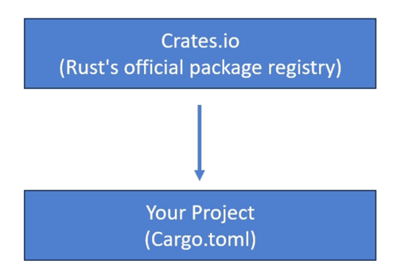

# [package] section of cargo.toml, Semantic Versioning

## Exercise

뉴욕 타임즈(The New York Times)에서 주요 헤드라인(Top Headlines)을 가져와 표시하는 Rust `Application` 작성하기

( 이 강의의 리소스 섹션에서 첨부된 `Cargo.toml` 및 `main.rs` 파일을 다운로드할 수 있음)


## External crates

개발자들은 이 `platform` 에 자신의 `library` 를 `crate` 로 게시하여 다른 사람들이 사용할 수 있도록 함

Rust `project` 에서 `external` `crate` 를 사용하려면, `project` 의 `Cargo.toml` 파일 내 `[dependencies]` 섹션 아래에 선언해야 함



https://developer.nytimes.com/docs/top-stories-product/1/overview

https://developer.nytimes.com/my-apps/

`Cargo.toml` 의 예시

```toml
[package]
name = "my_project"
version = "0.1.0"
authors = ["Your Name <you@example.com>"]
edition = "2021"
description = "An example project with multiple sections"

[dependencies]
serde = "1.0.130"
reqwest = "0.11.6"

[build-dependencies]
cc = "1.0.71"

[dev-dependencies]
criterion = "0.3.5"

[features]
default = ["logging"]
logging = []

[target.'cfg(target_os="linux")'.dependencies]
openssl = "0.10.38"

[profile.release]
optimizations = true
lto = "thin"
```

* `Cargo.toml` 파일의 `[]` 는 `Cargo` 의 `specification` 에 의해 정의된 `sections` 임
* 각 `section` 은 일반적으로 해당 특정 `section` 에 관련된 `key-value` 쌍 세트를 포함함 이러한 `key-value` 쌍은 `section` 과 관련된 다양한 측면을 **설정(configure)** 하는 데 사용됨

더 읽어보기 : https://doc.rust-lang.org/cargo/reference/manifest.html

### Section: `[package]`

`[package]` `section` 은 `package` 자체를 정의하고 **설정(configure)** 하는 데 **사용됨 이름(name)**, `version`, **작성자(authors)**, **에디션(edition)** 과 같이 `package` 에 대한 `metadata` 를 제공하는 `key-value` 쌍을 포함함

`Cargo.toml` 파일의 `version` 필드는 사용 중인 Rust 컴파일러의 버전을 나타내지 않음 이것은 이 `project` 의 `version` 을 참조함

```toml
[package]
name = "nyt_top_stories"
version = "0.1.0"
edition = "2021"
authors = ["Your Name<you@example.com>"]
description = "A project to fetch news top stories"
```

### Semantic Versioning (SemVer) 규약 (https://semver.org/)

**SemVer**에서, 버전 번호는 세 부분으로 구성됨: `MAJOR.MINOR.PATCH`

1. **MAJOR 버전**: 호환되지 않는 `API` 변경 시 증가시킴 하위 호환성(**backward compatibility**)을 깨는 중대한 변경을 할 경우, **MAJOR 버전**을 증가시킴 (예: `2.0.0`)
2. **MINOR 버전**: 하위 호환성을 유지하면서 기능을 추가할 때 증가시킴 하위 호환성을 깨지 않고 새로운 기능을 추가하면, **MINOR 버전**을 증가시킴 (예: `2.1.0`)
3. **PATCH 버전**: 하위 호환성을 유지하는 버그 수정을 할 때 증가시킴 버그 수정 및 사소한 변경의 경우, **PATCH 버전**을 증가시킴 (예: `2.1.1`)

### Version = `"0.1.0"`

소프트웨어 개발에서 **SemVer**를 따르는 `0.1.0` 과 같은 버전 번호는 일반적으로 해당 `package` 가 개발 초기 불안정 단계에 있음을 나타냄 사용자(Users)와 개발자(developers)는 버전 간의 변경, 심지어 MINOR 또는 PATCH 버전 변경조차도 기존 기능을 잠재적으로 손상시킬 수 있음을 예상해야 함