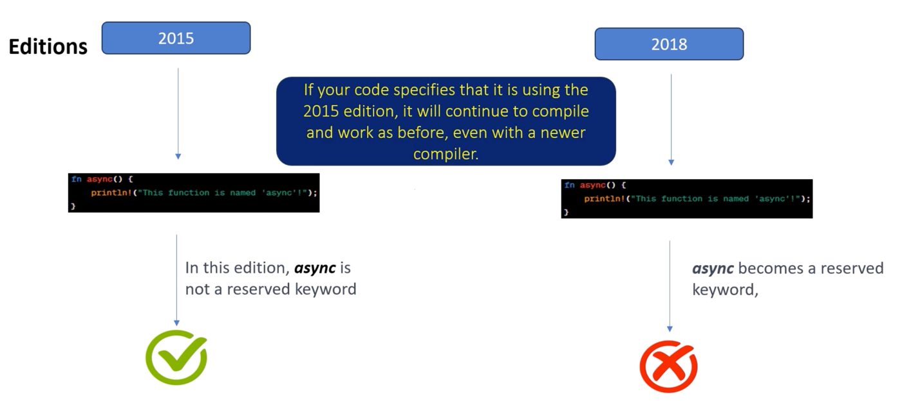

# Rust editions

## Rust `edition` 이란 무엇인가?

Rust가 하위 호환성(backward compatible)이 없는 변경 사항을 도입해야 할 때, 새로운 `edition` 을 통해 이를 수행함 이 접근 방식은 기존 `code` 가 기능적이고 안정적으로 유지되도록 보장하면서 Rust가 발전하고 새로운 기능을 추가할 수 있게 함

**현재까지의 Editions:**

* `Rust 2015` (Rust 버전 `1.0`)
* `Rust 2018` (Rust 버전 `1.31.0`)
* `Rust 2021` (Rust 버전 `1.56.0`)

> Rust `2024` `Edition` 은 `2024년 10월 17일` 에 변경 사항을 확정하고, `2024년 11월 28일` 까지 `nightly` `channel` 에서 안정화(stabilization) 단계에 도달하며, `2025년 2월 20일` 에 Rust 버전 `1.85.0` 과 함께 공식적으로 안정(stable) 버전이 될 계획임



> 만약 당신의 `code` 가 `2015` `edition` 을 사용한다고 명시하면, 더 새로운 `compiler` 를 사용하더라도 이전과 같이 계속 컴파일되고 작동할 것임

* ✅ 2015 `edition` 에서는 `async` 는 예약된 키워드(reserved `keyword`)가 아님
* ❌ 2018 `edition` 에서는 `async` 는 예약된 `keyword` 가 됨

## Mixing editions

> 동일한 `project` 내의 다른 `crate` 들은 서로 다른 `edition` 을 사용할 수 있음

## Why modules?

`project` 에서 `module` 을 사용하는 주요 이유

**Hierarchical Structure (계층적 구조)**

Rust의 `module` 시스템은 `crate` 내부에 트리(tree) 같은 `module` 계층(hierarchy)을 생성할 수 있게 함 이 계층은 `code` 내의 논리적 분할(logical divisions)을 반영하여, 다른 기능(functionalities), 컴포넌트(components), 또는 도메인(domains)을 분리할 수 있음

```bash
math_library_crate
├── mod arithmetic
│   └── mod operations
│       ├── fn add
│       └── fn subtract
└── mod geometry
    └── mod shapes
        ├── mod rectangle
        │   └── fn area
        └── mod circle
            └── fn area
```