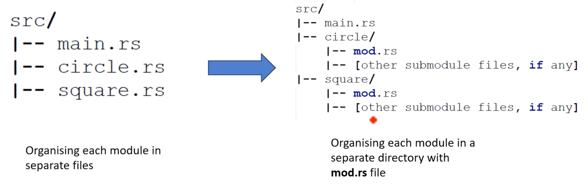
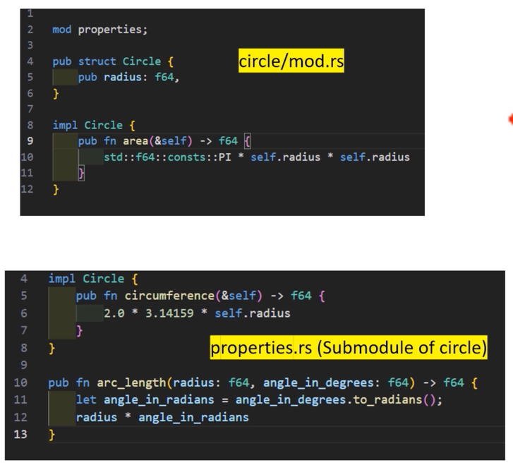

# Organizing modules into separate files

main.rs

```rust
mod circle {
    pub struct Circle {
        pub radius: f64,
    }

    impl Circle {
        pub fn area(&self) -> f64 {
            // 원의 넓이 계산: π * r^2
            std::f64::consts::PI * self.radius * self.radius
        }
    }
}

mod square {
    pub struct Square {
        pub side: f64,
    }

    impl Square {
        pub fn area(&self) -> f64 {
            // 정사각형의 넓이 계산: side * side
            self.side * self.side
        }
    }
}

fn main() {
    let c = circle::Circle { radius: 5.0 };
    println!("Circle area: {}", c.area());

    let s = square::Square { side: 4.0 };
    println!("Square area: {}", s.area());
}
```

circle.rs

```rust
pub struct Circle {
    pub radius: f64,
}

impl Circle {
    pub fn area(&self) -> f64 {
        // 원의 넓이 계산: π * r^2
        std::f64::consts::PI * self.radius * self.radius
    }
}
```

square.rs

```rust
pub struct Square {
    pub side: f64,
}

impl Square {
    pub fn area(&self) -> f64 {
        // 정사각형의 넓이 계산: side * side
        self.side * self.side
    }
}
```

main.rs

```rust
/* These statements instruct the Rust compiler to look for and include the contents of specific files.
* mod circle; The compiler will look for a file
* named 'circle.rs' (or a circle/mod.rs file if you're using a directory for the module).
* This file should be in the same directory as the file containing the 'mod circle;' statement,
* same applies to mod square;
*/
mod circle;
mod square;

fn main() {
    let c = circle::Circle { radius: 5.0 };
    println!("Circle area: {}", c.area());

    let s = square::Square { side: 4.0 };
    println!("Square area: {}", s.area());
}
```



circle/mod.rs

```rust
pub mod properties;

pub struct Circle {
    pub radius: f64,
}

impl Circle {
    pub fn area(&self) -> f64 {
        // 원의 넓이 계산: π * r^2
        std::f64::consts::PI * self.radius * self.radius
    }
}
```

circle/properties.rs

```rust
use super::Circle; // 상위 모듈에서 Circle 구조체를 가져옴

impl Circle {
    pub fn circumference(&self) -> f64 {
        2.0 * 3.14159 * self.radius
    }
}

pub fn arc_length(radius: f64, angle_in_degrees: f64) -> f64 {
    let angle_in_radians = angle_in_degrees.to_radians();
    radius * angle_in_radians
}
```

square/mod.rs

```rust
pub struct Square {
    pub side: f64,
}
```

square/properties.rs

```rust
use super::Square; // 상위 모듈에서 Square 구조체를 가져옴

impl Square {
    pub fn area(&self) -> f64 {
        // 정사각형의 넓이 계산: side * side
        self.side * self.side
    }
}
```

main.rs

```rust
mod circle;
mod square;

fn main() {
    let c = circle::Circle { radius: 5.0 };
    println!("Circle Area: {}", c.area());
    println!("Circle Circumference: {}", c.circumference());
    let arc_angle = 90.0;
    let arc_length = circle::properties::arc_length(c.radius, arc_angle);
    println!("Length of a {}° arc: {}", arc_angle, arc_length);

    let s = square::Square { side: 4.0 };
    println!("Square Area: {}", s.area());
}
```



여기서 `Circle` `struct` 는 `public` (부모 `module` 에서 `pub` 으로 선언됨)이며, 그 구현 내의 모든 `public` `method` (`pub fn`) 또한 `submodule` 의 가시성(visibility)에 관계없이 `Circle` `struct` 에 접근 가능한 모든 곳에서 접근 가능함