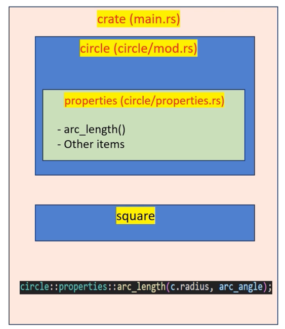
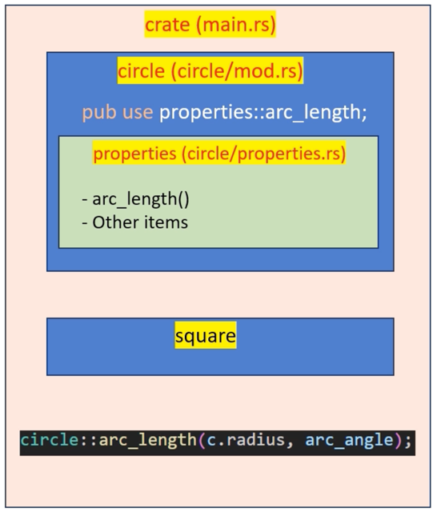

# Re-exporting





`Re-exporting` 은 `users` 가 `code` 의 내부 `structure` 를 알 필요 없이 한 `module` 의 `item` 을 다른 `module` 에서 사용할 수 있게 함

예를 들어, `circle` `module` 에서 `arc_length` 를 재내보내기하면 (`pub use properties::arc_length;`), `users` 는 `properties` `submodule` 에 대해 알 필요 없이 `circle::arc_length` 로 직접 접근할 수 있음


circle/mod.rs

```rust
// `Module` 선언(declaration). 이것은 `compiler` 에게 명시된 `module` 을 `build` 의 일부로 포함하도록 지시함
pub mod properties;

// `Re-exporting` the `item`. 이것은 해당 `item` 을 재내보내는 `module` 을 통해 `external` `code` 에서 `item` 에 접근할 수 있게 만듦
pub use properties::arc_length; // arc_length를 circle 모듈에서 재내보냄

pub struct Circle {
    pub radius: f64,
}

impl Circle {
    pub fn area(&self) -> f64 {
        // 원의 넓이 계산: π * r^2
        std::f64::consts::PI * self.radius * self.radius
    }
}
```

circle/properties.rs

```rust
use super::Circle; // 상위 모듈에서 Circle 구조체를 가져옴

impl Circle {
    pub fn circumference(&self) -> f64 {
        2.0 * 3.14159 * self.radius
    }
}

pub fn arc_length(radius: f64, angle_in_degrees: f64) -> f64 {
    let angle_in_radians = angle_in_degrees.to_radians();
    radius * angle_in_radians
}
```

square/mod.rs

```rust
pub struct Square {
    pub side: f64,
}
```

square/properties.rs

```rust
use super::Square; // 상위 모듈에서 Square 구조체를 가져옴

impl Square {
    pub fn area(&self) -> f64 {
        // 정사각형의 넓이 계산: side * side
        self.side * self.side
    }
}
```

main.rs

```rust
mod circle;
mod square;

fn main() {
    let c = circle::Circle { radius: 5.0 };
    println!("Circle Area: {}", c.area());
    println!("Circle Circumference: {}", c.circumference());
    let arc_angle = 90.0;
    let arc_length = circle::arc_length(c.radius, arc_angle);
    println!("Length of a {}° arc: {}", arc_angle, arc_length);

    let s = square::Square { side: 4.0 };
    println!("Square Area: {}", s.area());
}
```