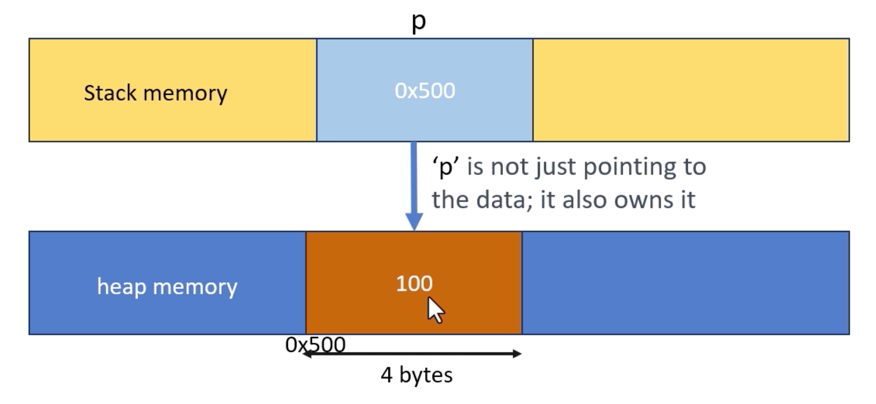

# Smart pointers in Rust

1.  `Box<T>`
2.  `Rc<T>`
3.  `Arc<T>`
4.  `Cell<T>`
5.  `RefCell<T>`
6.  `Mutex<T>`
7.  `RwLock<T>`
8.  `Cow<B>`

## Box<T>

- `Box<T>` 타입은 T 타입의 값을 힙 메모리에 할당해야 할 때 사용된다
-`let mut p: Box<i32> = Box::new(100);` 여기서, i32 값 100은 힙에 4바이트를 차지하지만, 스택에 있는 p(`Box<i32>`)는 단일 포인터에 필요한 공간만 차지한다 (64비트 시스템에서: 포인터 크기는 8바이트이므로 p는 스택에서 8바이트를 차지한다)
-데이터의 소유자로서, `Box<T>`는 데이터가 스코프(scope)를 벗어날 때 정리(cleaning up)하는 역할을 한다
-`Box<T>`에 의한 소유권은 고유하다. 데이터에 대한 소유자는 한 번에 오직 하나만 존재할 수 있으며, 이는 수동 메모리 관리에서 흔히 발생하는 이중 해제 오류(double-free errors) 및 데이터 경쟁(data races)과 같은 문제를 방지한다

소스 및 관련 콘텐츠


```rust
// 숫자를 heap memory에 저장해 봅시다
fn main() {
    let p: Box<i32> = Box::new(100);
    println!("{}", p);
}
```

```bash
100
```

```rust
// 숫자를 heap memory에 저장해 봅시다
fn main() {
    let p: Box<i32> = Box::new(100);
    println!("{:p}", p);
}
```

```bash
0x55de9f94e9d0
```

```rust
// 숫자를 heap memory에 저장해 봅시다
fn main() {
    let p: Box<i32> = Box::new(100);
    println!("{}", p);
    *p = 200;
    println!("{}", p);
}
```

```bash
100
200
```

```rust
// 숫자를 heap memory에 저장해 봅시다
fn main() {
    let val = 100;
    let p: Box<i32> = Box::new(val);
    println!("{}", p);
    *p = 200;
    println!("{}", p);
    println!("{}", val);
}
```

```bash
100
200
100
```


### Memory Layout

