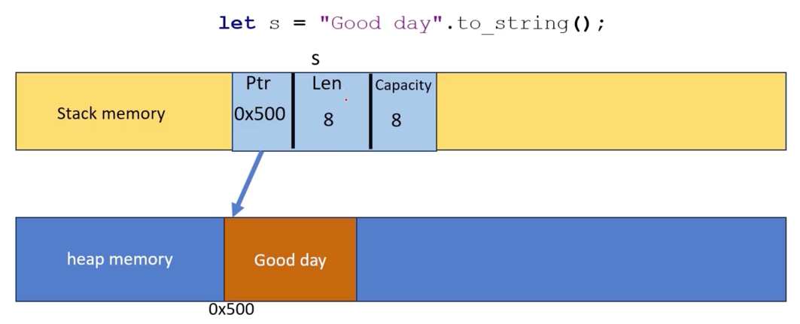
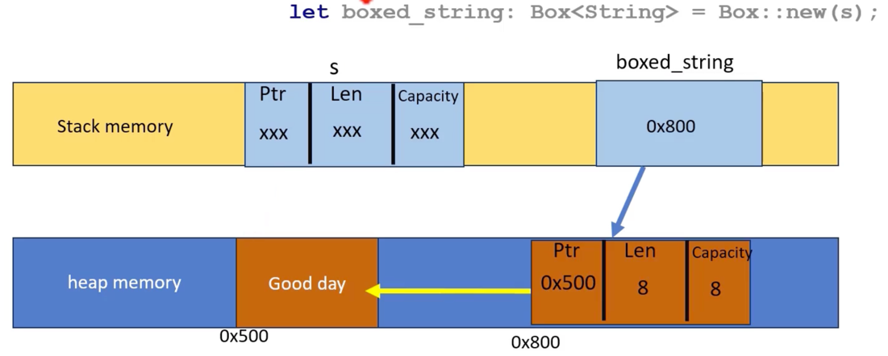

# `Box<String>`

```rust
fn main() {
    let s = "Good day".to_string();
    let boxed_string: Box<String> = Box::new(s);
    println!("{}", boxed_string);
}
```

```bash
Good day
```

```rust
fn main() {
    let s = "Good day".to_string();
    let boxed_string: Box<String> = Box::new(s);
    println!("{}", boxed_string);
    println!("{}", s);
}
```

```bash
Exited with status 101
Standard Error
Compiling playground v0.0.1 (/playg
error[E0382]: borrow of moved value:
 --> src/main.rs:6:17
  |
3 | let s = "Good day".to_string();
  |       - move occurs because `s` has
4 | let boxed_string: Box<String> = B
  |
```

## Memory Layout




