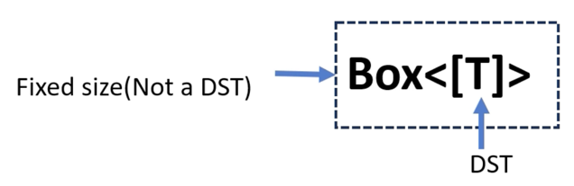

# `Box<T>`

## slice Boxing : Box<[T]>

### &[T] 대신 `Box<[T]>`를 사용하는 이유?

### `&[T]` 또는 `&mut [T]` (`Borrowed slice`)

* 데이터를 소유하지 않는다; `memory`에 있는 기존 `slice` 데이터를 참조할 뿐이다
* 참조하는 데이터는 `slice` 자체보다 더 오래 존재해야 한다
* `ownership`을 가지지 않고 `array` 또는 `vector`의 일부를 읽거나 처리하고 싶을 때 이상적이다

### `Box<[T]>` (`Owned slice`)

* `slice`를 소유하며 `memory`를 관리하는 역할을 한다
* 가리키는 데이터는 `heap`에 저장되며 `Box`는 `scope`를 벗어날 때 `memory`가 정리되도록 보장한다
* `slice`의 `ownership`을 원할 때 유용하다
* `.into_boxed_slice()`를 사용하여 `Vec<T>`를 `Box<[T]>`로 변환할 수 있다

```rust
fn main() {
    let array = [1, 2, 3, 4, 5, 6, 7, 8, 9];

    let s1: Box<[i32]> = Box::from(&array[0..=2]);

    println!("Slice 1: {:?}", s1);
}
```

```bash
Slice 1: [1, 2, 3]
```

```rust
fn main() {
    let array = [1, 2, 3, 4, 5, 6, 7, 8, 9];

    let s1: Box<[i32]> = array[0..=5].to_vec().into_boxed_slice();

    let subslice_of_s1 = s1[0..=1].to_vec().into_boxed_slice();

    println!("Slice 1: {:?}", s1);
    println!("Slice 2: {:?}", subslice_of_s1);
}
```

```bash
Slice 1: [1, 2, 3, 4, 5, 6]
Slice 2: [1, 2]
```

```rust
fn main() {
    let array = [1, 2, 3, 4, 5, 6, 7, 8, 9];

    let s1: Box<[i32]> = array[0..=5].to_vec().into_boxed_slice();

    let subslice_of_s1: Box<[i32]> = s1[0..=1].to_vec().into_boxed_slice();

    let s2: &[i32] = &s1[3..=4];

    println!("Slice 1: {:?}", s1);
    println!("Slice 2: {:?}", subslice_of_s1);
    println!("Slice 2: {:?}", s2);
}
```

```bash
Slice 1: [1, 2, 3, 4, 5, 6]
Slice 2: [1, 2]
```

## `&[T]` 대신 `Box<[T]>`를 사용하는 이유?

`&[T]`를 사용하면 `slice`가 참조하는 `data`가 `borrow`보다 더 오래 존재해야 한다  
이 제약은 `Box<[T]>`에는 존재하지 않는다 왜냐하면 `Box<[T]>`는 `data`를 `owns`하기 때문이다

