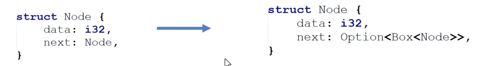
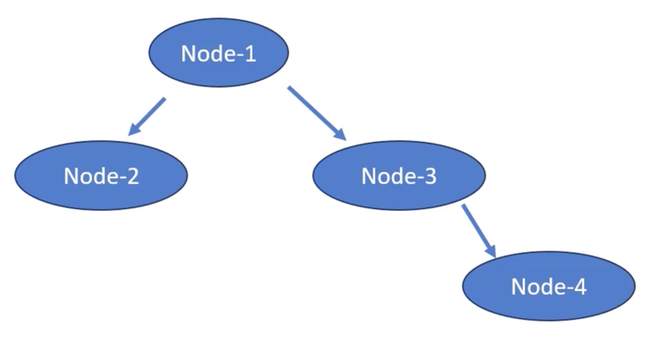

# `Box<T>`를 사용하여 `Recursive Types` 활성화하기

`Recursive types`는 자신을 `definition`의 일부로 참조하는 `types`이다

```rust
struct Node {
    data: i32,
    next: Node,
}
```

`member field`로 자기 자신의 `instance`를 포함하는 `structure`

```rust
enum FileSystemNode {
    File(String),
    Directory(String, Vec<FileSystemNode>),
}
```

`Recursive types`는 `type`의 `instance`가 `the same type`의 또 다른 `instance`를 포함할 수 있는 것이다

## `infinite size`를 가진 `Recursive type`

```rust
struct Node {
    data: i32,
    next: Node,
}
```

`member field`로 자기 자신의 `instance`를 포함하는 `structure`

```rust
struct Node {
    data: i32,
    next: Node,
}

fn main() {
    let node = Node {
        data: 50,
        next: Node {
            data: 60,
            next: Node {
                data: 70,
            }
        }
    };
}
```

```bash
Exited with status 101
Standard Error
Compiling playground v0.0.1 (/playground)
error[E0072]: recursive type `Node` has infinite size
--> src/main.rs:1:1
  |
1 | struct Node {
  | ^^^^^^^^^^^
2 |     data: i32,
3 |     next: Node,
```

## Indirection`을 가진 `Recursive type`



`infinite size`를 가진 `Recursive type`  ->  `Box<T>`를 가진 `indirection`을 가진 `Recursive type`는 `finite size`로 이어진다



```rust
struct Node {
    data: i32,
    next: Option<Box<Node>>,
}

fn main() {
    let node_4 = Node {
        data: 50,
        next: None,
    };

    let node3 = Node {
        data: 40,
        next : Some(Box::new(node_4)),
    };

    println!("{:?}", node3);
}
```

```bash
Node {
  data: 40,
  next: Some(
    Node {
      data: 50,
      next: None,
    },
  ),
}
```

## 요약: Indirection`을 가진 `Recursive type`

`self-referencing types`를 가질 때, `Box<T>`와 같은 `tools`를 통한 `indirection`을 사용하는 것은 그것들의 `size`를 `finite`하게 만든다 이것은 `Box<T>`가 실제 `data`의 `size`와 상관없이 `data`에 대한 `fixed-size pointer`를 제공하기 때문이다