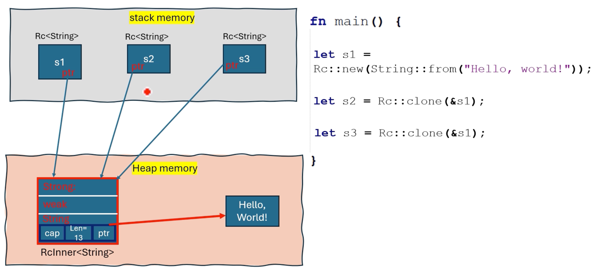

# `Rc<T>`

`Rc<T>`는 `single-threaded application`의 여러 부분이 동일한 `data`의 `ownership`을 공유해야 하고, 해당 `data`의 `lifetime`이 어떤 `single owner`에게도 묶여서는 안 되는 `scenario`에서 유용하다

```rust
use std::rc::Rc;

fn main() {
    // `Rc<T>`를 사용한 `shared ownership`
    // 세 개의 `variables` (`s1`, `s2`, `s3`)가 동일한 `string data`를 `own`한다
    // 모든 `Rc pointers`가 `scope`를 벗어날 때까지 `data`는 `dropped`되지 않는다
    let s1 = Rc::new(String::from("Hello, world!"));
    let s2 = Rc::clone(&s1);
    let s3 = Rc::clone(&s1);

    println!("Owner 1: {}", s1);
    println!("Owner 2: {}", s2);
    println!("Owner 3: {}", s3);
}
```

```bash
Owner 1: Hello, world!
Owner 2: Hello, world!
Owner 3: Hello, world!
```

## Memory representation



## `Rc<T>`를 사용한 Shared ownership

1) `Rc<T>`는 `heap`에 할당된 `T` 타입 `data`의 shared ownership을 제공한다
2) `Rc<T>`는 `immutable data` 전용이다
3) `single-threaded` 환경에서 `multiple owners`가 공유하는 `data`를 `mutate`하려면, `RefCell<T>` 와 `Rc<T>` 를 함께 사용해야 한다. 이 조합은 `interior mutability`를 허용하면서 `multiple owners`를 가능하게 한다
4) `Rc<T>`는 모든 소유자가 `the same thread`에 있다고 가정하기 때문에 `lightweight`하다. `overhead`를 추가하는 `atomic operations`를 사용하지 않는다
5) `multi-threaded` `applications`의 `Rc<T>` `counterpart`는 `Arc<T>` 이다
6) `multiple threads` 간 `data`를 `safely` `share`해야 할 때 `Arc<T>` 를 사용한다